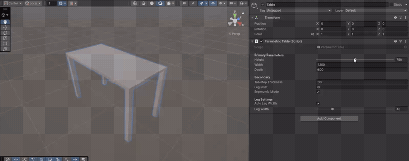
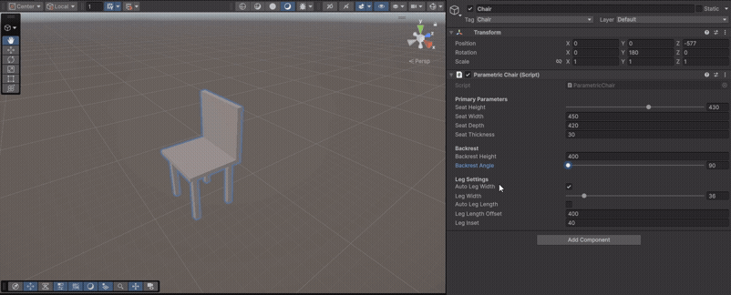

# Параметрический алгоритм синусоиды

Прикладываю билд — можно запустить самостоятельно.  
Ниже демонстрации в GIF.

## Как запустить

Build:  
https://drive.google.com/drive/folders/1E28d0rL1tHFSMFWNA69e-7vlWQS4n8k_?usp=sharing

Скачайте архив и запустите `Params-test.exe`.  
Исходный код доступен на GitHub.

---

Скрипт `SineWaveDrawer` в Unity строит синусоиду и перемещает точку вдоль неё.  
Форма полностью зависит от параметров.

## Принцип работы

Скрипт:

1. Рисует синусоиду через `LineRenderer`.
2. Перемещает объект (`movingPoint`) вдоль кривой.

Пересчёт происходит каждый кадр в `Update()`.

---

## Основные параметры

- `amplitude` — высота волны  
- `wavelength` — расстояние между пиками  
- `length` — общая длина волны  
- `points` — плавность линии  
- `normalizedPosition (0–1)` — положение точки вдоль кривой  

---

## Построение волны

Для каждой точки:

```
t = i / (points - 1)
x = t * length
y = sin(x * 2π / wavelength) * amplitude
```

| Параметр | Результат |
|----------|-----------|
| Amplitude | Волна выше или ниже |
| Wavelength | Волна чаще или реже |
| Length | Волна длиннее |
| Points | Более плавная линия |
| Normalized Position | Движение точки |

---

## Демонстрация

<p align="center">
  
</p>

---

# Параметрическая модель «Стол» и «Стул»

Данные параметрические модели стола и стула были созданы в Unity.  
Идея простая: меняем несколько основных параметров — объект автоматически перестраивается.

---

# 1. Стол

## Основные параметры

Самые важные параметры:

- `height` — высота стола (обычно 740–760 мм)  
- `width` — ширина столешницы  
- `depth` — глубина столешницы  
- `tabletopThickness` — толщина столешницы  

При изменении высоты:

- столешница поднимается выше  
- ножки автоматически становятся длиннее  

Если включён `ergonomicMode`, высота ограничена диапазоном 740–760 мм.

---

## Как рассчитываются ножки

Высота ножек:

```
legHeight = height - tabletopThickness
```

То есть ножка — это всё расстояние до столешницы минус её толщина.  
Ножки автоматически располагаются по углам и сдвигаются внутрь на небольшой отступ.

---

## Изменение параметров

- **height** → ножки становятся длиннее или короче  
- **width** → ножки разъедутся шире  
- **depth** → ножки раздвинутся по глубине  

Все изменения происходят автоматически.

---

## Демонстрация

<p align="center">
  
</p>

---

# 2. Стул

## Основные параметры

- `seatHeight` — высота сиденья (400–450 мм)  
- `seatWidth` — ширина сиденья  
- `seatDepth` — глубина сиденья  
- `backrestHeight` — высота спинки  
- `backrestAngle` — угол наклона спинки  

---

## Как работает высота стула

Высота ножек:

```
legHeight = seatHeight - seatThickness
```

При изменении `seatHeight`:

- сиденье поднимается  
- ножки автоматически удлиняются  

Высота ограничена диапазоном 400–450 мм.

---

## Как работает спинка

- размещается сзади сиденья  
- наклоняется (угол 90–110°)  
- масштабируется по ширине сиденья  

Изменение угла меняет наклон спинки.

---

## Особенность задних ножек

Можно включить удлинение задних ножек (`autoLegLength`), тогда они становятся длиннее и поддерживают спинку.

---

## Демонстрация

<p align="center">
  
</p>

---

# 3. Связь стола и стула

Для комфорта:

```
Разница = высота стола − высота сиденья ≈ 270–320 мм
```

- Слишком маленькая разница → тесно  
- Слишком большая → неудобно

---

# 4. Главное

**Стол:**

- главный параметр — высота  
- ножки подстраиваются автоматически  

**Стул:**

- главный параметр — высота сиденья  
- спинка наклоняется  
- задние ножки могут удлиняться  

Все изменения происходят автоматически — достаточно менять параметры.

---

# Итог

Это простая параметрическая система:

- меняем параметры  
- Unity пересчитывает размеры  
- модель перестраивается без ручного редактирования  

Подходит для прототипирования мебели и экспериментов с размерами.
